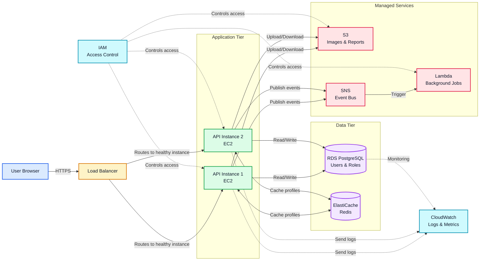

# Understanding Cloud Infrastructure

When I first started exploring AWS, I found the number of services confusing.

EC2, S3, VPC, Lambda, RDS, IAM, CloudWatch... there are so many names that it is difficult to understand where to begin.

The problem is not always learning each service individually. The bigger problem is understanding **how these services work together**.

In this article, we will look at the main building blocks of cloud infrastructure:

- Compute
- Networking
- Storage
- Databases
- Managed services
- Security and monitoring

We will use a simple **user management system** as an example throughout the article. Users will be able to register, sign in, update their profiles, and view their account information.

## 1. What is cloud infrastructure?

Cloud infrastructure is the collection of resources required to run applications and services.

These resources include:

- Servers
- Networks
- Storage
- Databases
- Security controls
- Monitoring systems

In the past, companies usually purchased physical servers and maintained them in their own data centers.

If a company needed more servers, it had to purchase additional hardware, configure it, and maintain it.

Cloud platforms changed this approach.

With platforms such as AWS, you can request computing resources through a web console, command line, or API.

You do not necessarily need to purchase physical hardware yourself.

For example, imagine you want to run a Java Spring Boot application for a user management system.

You need somewhere to execute the application, a way for users to access it, and somewhere to store its data.

Cloud infrastructure provides the building blocks for this.


## 3. Networking: How services communicate

Networking connects users, application servers, databases, and other cloud services.

A network for the user management system should allow public requests to reach the application while keeping databases and internal services private.

### Amazon VPC

An Amazon Virtual Private Cloud, or VPC, is an isolated network that you control inside AWS.

A VPC has an IP address range and can contain subnets, route tables, internet gateways, and security controls.

A typical layout looks like this:

```text
Internet
   |
Internet Gateway
   |
Public Subnet: Load Balancer
   |
Private Subnet: User Management API
   |
Private Subnet: RDS Database
```

The load balancer can receive traffic from the internet, while the API and database remain in private subnets.

### Subnets

A subnet is a smaller section of a VPC. Subnets are commonly divided into public and private subnets.

- **Public subnets** have a route to the internet and can contain a load balancer.
- **Private subnets** do not accept direct inbound internet traffic and can contain application servers and databases.

For high availability, create subnets in more than one Availability Zone. If one data center has a problem, another can continue serving requests.

### Load balancer

A load balancer distributes incoming requests across multiple application instances.

For the user management system, a user might request `GET /users/42`. The load balancer receives that request and forwards it to a healthy Spring Boot instance.

This provides two useful benefits:

1. Traffic is shared between instances.
2. Unhealthy instances can be removed from service automatically.

### Security groups

Security groups act as virtual firewalls for cloud resources. They control which inbound and outbound connections are allowed.

A simple set of rules could be:

- The load balancer accepts HTTPS traffic on port 443 from the internet.
- The API instances accept traffic only from the load balancer security group.
- The RDS database accepts traffic only from the API security group.
- SSH access is restricted to an administrative network, or replaced with a managed session service.

This layered design means a user cannot connect directly to the database, even if the database hostname becomes known.


## 5. Databases: Storing structured information

A user management system has structured data: user IDs, email addresses, password hashes, profile details, roles, and timestamps.

A database provides durable storage, indexes, transactions, and a way to query this information safely.

### Amazon RDS

Amazon RDS is a managed relational database service. It supports engines such as PostgreSQL and MySQL.

A relational database is a natural choice for users because the data has clear relationships and needs transactions. A simplified table might look like this:

```text
users
-----
id
email
password_hash
display_name
role
created_at
updated_at
```

When a user registers, the Spring Boot API validates the request, hashes the password, and writes a new row to the `users` table. The plain-text password should never be stored.

RDS can provide automated backups, encryption, patching options, and Multi-AZ deployment. The database should be placed in private subnets and its security group should allow connections only from the application servers.

### DynamoDB

Amazon DynamoDB is a managed NoSQL database. It is useful when an application needs very fast access at scale and its access patterns fit a key-value or document model.

For example, the system could use DynamoDB for login attempt records or a user preference document keyed by `userId`.

DynamoDB is not automatically better than a relational database. Choose it when its flexible schema, scaling model, and access patterns match the problem.

### Structured data and transactions

The user management system may update a user record and an audit record together. A relational transaction can ensure that both changes succeed or both are rolled back.

Whichever database is selected, plan for:

- Indexes for common queries such as email lookup
- Encryption at rest and in transit
- Backups and restore testing
- Connection limits and pooling
- Least-privilege database credentials


## 7. Security and monitoring

Security and monitoring should be included from the beginning rather than added after deployment.

### CloudWatch

Amazon CloudWatch collects metrics, logs, and alarms. The user management system can send application logs from the Spring Boot API to CloudWatch.

Useful metrics and alarms include:

- High CPU or memory usage
- Increased API error rates
- Slow database queries
- Failed login spikes
- Low database storage
- Unhealthy load balancer targets

Logs should contain enough information to troubleshoot a request, but should not contain passwords, session tokens, or unnecessary personal information.

### IAM and security controls

Use IAM roles with the smallest practical set of permissions. Separate permissions for development, testing, and production environments.

Additional controls can include:

- HTTPS for all user-facing traffic
- Encryption at rest for S3, EBS, and RDS
- Secrets stored in a secrets manager rather than source code
- Multi-factor authentication for administrators
- Private subnets for APIs and databases
- Network and application-level validation
- Dependency and operating system updates
- Audit logs for administrative actions

Application security also matters. Passwords should be hashed with a modern password-hashing algorithm, authentication tokens should expire, and authorization checks should verify that a user is allowed to access the requested account.

### Backups and recovery

Backups protect against accidental deletion, software bugs, and infrastructure failures. Enable automated database backups and versioning where appropriate for important S3 objects.

A backup is useful only if it can be restored. Periodically test restoring a database and recovering an application in a separate environment. Define a recovery point objective, which describes how much data loss is acceptable, and a recovery time objective, which describes how quickly the system should return to service.

---

## Putting it all together

The user management system can be organized as the following production-oriented architecture:



### Architecture flow

1. A user sends an HTTPS request from the browser to the Application Load Balancer. The load balancer terminates TLS, performs health checks, and routes traffic only to healthy EC2 API instances.
2. The API instances run in private subnets and remain stateless, allowing the service to scale horizontally. Each instance validates input, authenticates the request, and applies the user-management business rules.
3. RDS PostgreSQL is the system of record for users, roles, and audit records. Transactions keep related changes consistent, while backups and Multi-AZ options can improve durability and availability.
4. ElastiCache stores short-lived profiles, permissions, and other frequently requested data. The API treats the cache as disposable and falls back to RDS when an entry is missing or expires.
5. S3 stores profile images and exported reports as durable objects. The database stores object metadata and keys rather than large binary files.
6. SNS receives events such as user registration or password changes. Lambda consumes those events asynchronously for tasks such as image processing, notifications, or audit enrichment, keeping the request path fast.
7. CloudWatch receives application logs, infrastructure metrics, and alarms from the API and data services. IAM roles grant each component only the permissions it needs, without embedding long-lived credentials in the application.

### Design principles applied

- **Separation of concerns:** Compute, durable data, object storage, messaging, and observability each have a focused responsibility.
- **Horizontal scalability:** Multiple stateless API instances behind a load balancer can scale independently as demand changes.
- **Durability by default:** RDS is the source of truth and S3 holds files; cached data can be rebuilt without data loss.
- **Asynchronous processing:** SNS and Lambda move slow or retryable work off the user-facing request path.
- **Least privilege and defense in depth:** Private subnets, security groups, encryption, and narrowly scoped IAM roles limit access.
- **Operational visibility:** Centralized logs, metrics, health checks, and alarms make failures easier to detect and diagnose.

This design is only one possible architecture. The correct services depend on traffic, availability requirements, team experience, cost, and compliance needs.

## Key takeaway

Cloud infrastructure is easier to understand when you view it as a group of responsibilities:

- Compute runs the application.
- Networking connects the application to users and other services.
- Storage keeps files and durable data.
- Databases organize structured information.
- Managed services handle common capabilities.
- Security and monitoring keep the system protected and observable.

Start with the application requirements, then choose the simplest architecture that meets them. For a user management system, that usually means a private application layer, a protected database, durable file storage, controlled permissions, useful monitoring, and tested backups.
