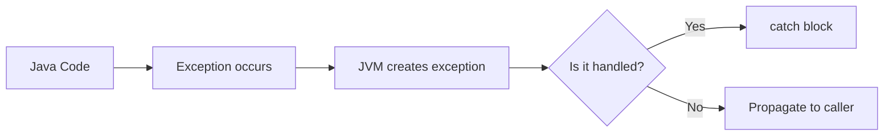
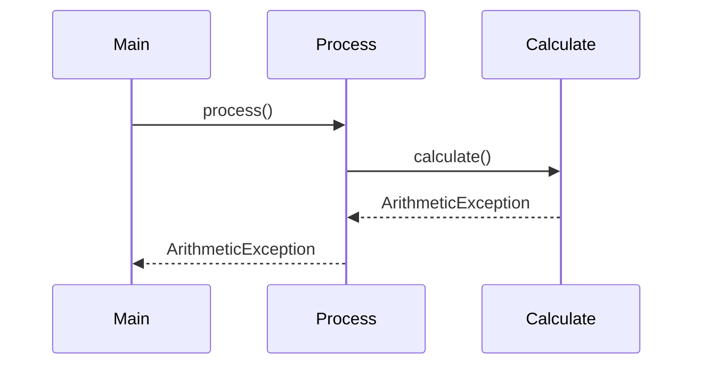
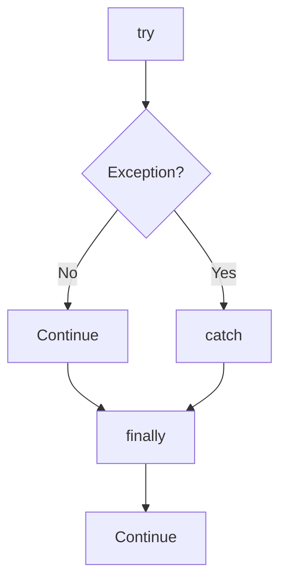

# Java Exception Handling: What Actually Happens When Something Goes Wrong

While working with Java backend applications, I quickly realized that handling the happy path is only half of the job.

An API can work perfectly when everything goes as expected.

But what happens when:

- a database connection fails?
- a user sends invalid input?
- a file does not exist?
- a service returns unexpected data?
- a method receives `null`?

This is where **exception handling** becomes important.

Instead of allowing an application to crash unexpectedly, Java gives us a structured way to detect, handle, and propagate errors.

---

## The basic idea

Consider this:

```java
int result = 10 / 0;
```

Java cannot perform this operation.

At runtime, an `ArithmeticException` is thrown.

Conceptually:



An exception changes the normal flow of execution.

That's the main thing I needed to understand.

---

# `try` and `catch`

The most basic way to handle an exception is:

```java
try {
    int result = 10 / 0;
} catch (ArithmeticException e) {
    System.out.println("Cannot divide by zero");
}
```

The code inside `try` contains the operation that might fail.

If an exception occurs, Java looks for a matching `catch` block.

The application can then continue instead of terminating at that point.

---

# What happens when an exception is thrown?

Suppose we have:

```java
public void process() {
    calculate();
}

public void calculate() {
    int result = 10 / 0;
}
```

There is no `try-catch` inside `calculate()`.

The exception moves back toward the caller.



This process is called **exception propagation**.

The exception continues up the call stack until Java finds a matching handler.

If nobody handles it, the thread terminates and Java prints the exception information.

---

# Checked vs unchecked exceptions

This is one of the most important Java concepts.

Java broadly separates exceptions into **checked** and **unchecked** exceptions.

### Checked exceptions

Checked exceptions are checked by the compiler.

For example:

```java
public void readFile() throws IOException {
    // file operation
}
```

The caller must either handle the exception:

```java
try {
    readFile();
} catch (IOException e) {
    // handle it
}
```

or declare that it will pass the exception onward:

```java
public void process() throws IOException {
    readFile();
}
```

### Unchecked exceptions

Unchecked exceptions generally extend `RuntimeException`.

Examples include:

```text
NullPointerException
IllegalArgumentException
ArithmeticException
IndexOutOfBoundsException
```

The compiler does not force us to catch these.

That doesn't mean they are harmless.

They usually indicate invalid state, invalid input, or a programming mistake that should be addressed appropriately.

---

# `finally`

Another important part of exception handling is `finally`.

```java
try {
    System.out.println("Processing");
} catch (Exception e) {
    System.out.println("Error");
} finally {
    System.out.println("Cleanup");
}
```

The `finally` block is commonly used for cleanup that should happen whether the operation succeeds or fails.

Conceptually:



For modern Java code, however, I wouldn't automatically use `finally` for every resource.

For resources such as files, Java provides **try-with-resources**.

---

# Try-with-resources

Instead of manually closing a resource:

```java
FileInputStream input = null;

try {
    input = new FileInputStream("data.txt");
} finally {
    if (input != null) {
        input.close();
    }
}
```

we can use:

```java
try (FileInputStream input = new FileInputStream("data.txt")) {
    // read file
}
```

Java automatically closes the resource after the `try` block.

This makes resource management safer and easier to read.

---

# Custom exceptions

Sometimes standard exceptions don't describe the problem clearly enough.

For example, imagine a banking application.

Instead of throwing:

```java
IllegalArgumentException
```

everywhere, we could create:

```java
public class InsufficientBalanceException extends RuntimeException {

    public InsufficientBalanceException(String message) {
        super(message);
    }
}
```

Then:

```java
if (amount > account.getBalance()) {
    throw new InsufficientBalanceException("Insufficient balance");
}
```

Now the exception communicates the actual business problem.

This becomes especially useful in backend applications where different failures need different responses.

---

# Exception handling in a backend API

Imagine a Spring Boot API:

```text
Client
   ↓
Controller
   ↓
Service
   ↓
Repository
   ↓
Database
```

An exception can travel through several layers.

```mermaid
flowchart LR
    Client["HTTP Client"] --> Controller["Controller"]
    Controller --> Service["Service"]
    Service --> Repository["Repository"]
    Repository --> DB["Database"]

    DB -.->|"Exception"| Repository
    Repository -.-> Service
    Service -.-> Controller
    Controller --> Response["HTTP Response"]
```



A common mistake is putting a huge number of `try-catch` blocks into every method.

That can make backend code difficult to maintain.

Instead, Spring applications commonly use centralized exception handling, for example with `@RestControllerAdvice`.

That allows application-wide exceptions to be converted into consistent HTTP responses.

For example:

```text
Invalid request
      ↓
IllegalArgumentException
      ↓
Global exception handler
      ↓
HTTP 400 Bad Request
```

This keeps business logic cleaner.

---

# What I learned

The biggest lesson for me is that exception handling isn't simply:

> "Put everything inside try-catch."

Good exception handling is about deciding:

- where an error should be handled
- where it should be propagated
- whether the exception represents a programming problem or a business problem
- what information should be logged
- what the client should actually receive

For example, this is usually not helpful:

```java
catch (Exception e) {
    e.printStackTrace();
}
```

It catches almost everything without deciding what should happen next.

A better approach is to handle exceptions at the appropriate layer and preserve enough information to diagnose the original problem.

---

# Final thought

When I started learning Java, exceptions felt like syntax:

```java
try {
} catch (Exception e) {
}
```

Now I see them as part of application design.

A backend application will eventually encounter failures.

The goal isn't to pretend those failures won't happen.

The goal is to make the failure path predictable.

For me, the useful mental model is:

```text
Something fails
      ↓
Exception is created
      ↓
Exception propagates
      ↓
Appropriate layer handles it
      ↓
Error is logged / translated
      ↓
Client receives a meaningful response
```

That's much more useful than simply memorizing `try`, `catch`, and `finally`.
