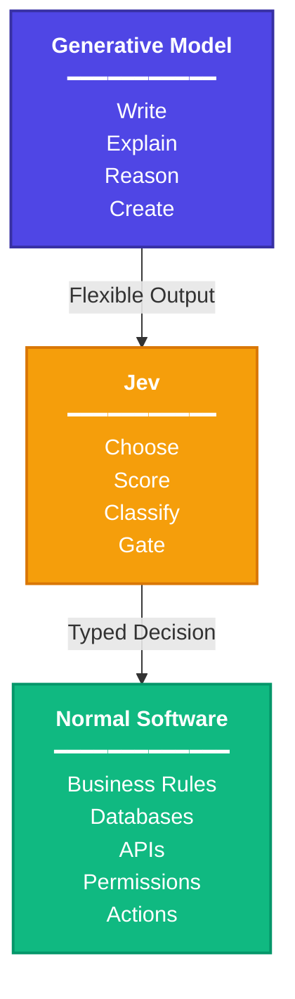

# Exploring Jev: An AI Model Built to Make Decisions, Not Conversations

I've spent a lot of time around the usual AI workflow: send a prompt to a language model, get some text back, and then figure out how my application should use that response.

That workflow is powerful, but it also creates an interesting engineering problem.

**What if I don't actually need the model to write anything?**

What if all I need is a decision?

Something like:

```text
Customer message
       ↓
      AI
       ↓
   "billing"
   confidence: 0.94
       ↓
Route to billing team
```

That is what made me interested in **Jev**, TypeSafe AI's first System One model.

Jev takes a different approach from a conventional conversational model. Instead of generating a paragraph for an application to interpret, you give it a state and focused questions, and it returns structured answers that software can work with directly. TypeSafe describes the basic flow as **state → question → decision → action**. citeturn0search0

This article is my exploration of that idea: what Jev is, where it fits, where it doesn't, and why I think the concept is worth understanding as a backend engineer.

---

## So, what exactly is Jev?

Jev is TypeSafe AI's first **System One** model. It was introduced in September 2026 as a model designed around structured decision-making rather than open-ended text generation. citeturn0news13turn0search0

The simplest way I can think about it is:

> **An LLM can generate an answer. Jev is designed to return a decision that software can act on.**

For example, imagine a support application receiving this message:

```text
"My internet connection has been dropping every few minutes
since yesterday. I have already restarted the router."
```

A general-purpose LLM could explain the problem, suggest troubleshooting steps, or write a response to the customer.

But maybe my application only needs to know:

```text
Which team should receive this ticket?
```

Possible answers:

```text
billing
technical_support
sales
account_management
```

That is a bounded decision.

I don't need an essay. I need a machine-readable result.

That is the space Jev is targeting. citeturn0search0

---

## The interesting part: the model doesn't decide the shape of the answer

This is probably the first thing I find interesting about Jev from an engineering perspective.

With a normal LLM, I might write something like:

```text
Classify this customer message into one of:
- billing
- technical_support
- sales
- account_management

Return JSON.
```

Then I have to worry about the generated response.

Did the model return valid JSON?

Did it invent another category?

Did it put an explanation outside the JSON?

Do I need to retry?

Do I need to validate the response?

With Jev, the question itself defines the expected shape of the decision. TypeSafe describes three core question types: **Choice, Score, and Noul**. citeturn0search0turn0search4

That changes the programming model from:

```text
Generate text → parse text → validate → decide
```

to something closer to:

```text
Define decision → receive typed result → execute code
```

That is a subtle difference, but for software systems it can be significant.

---

## Choice: "Which one?"

The first primitive is **Choice**.

You provide a set of possible options, and Jev selects among them.

For example:

```text
Question:
Which department should handle this ticket?

Options:
- billing
- technical_support
- sales
- account_management
```

Conceptually, the result can look like:

```text
choice: technical_support
confidence: 0.94
```

The model can also provide probabilities associated with the available choices. citeturn0search4

This makes Choice interesting for things such as:

- ticket routing
- intent classification
- tool selection
- content categorization
- workflow routing
- model routing

The important constraint is that **the possible answers are defined by the application**.

That is exactly what I want in many backend workflows.

---

## Score: "How much?"

The second primitive is **Score**.

Instead of choosing from completely unrelated labels, I can define an ordered scale and ask the model to place something on that scale.

For example:

```text
Score this support ticket for urgency.

1 = low
2 = moderate
3 = high
4 = critical
```

A decision system could then use the result:

```text
score < 2
    → normal queue

score >= 2 && score < 3
    → priority queue

score >= 3
    → immediate review
```

This is where the AI becomes a component inside normal application logic rather than the application itself.

The model provides the judgment.

**My code owns the action.**

TypeSafe documents Score as one of Jev's three typed question primitives. citeturn0search0

---

## Noul: "Is this true?"

The third primitive is called **Noul**.

It is essentially a yes/no judgement represented as a probability.

For example:

```text
Does this message contain a billing complaint?
```

The result might conceptually be:

```text
probability: 0.91
```

Then the application decides what threshold makes sense:

```text
>= 0.90 → automatically route
< 0.90  → send for review
```

That distinction matters.

The model doesn't have to decide what the business should do with the probability.

The application does.

That separation between **judgement** and **action** is one of the ideas I find most interesting about Jev.

---

## Multiple questions from the same state

Another interesting part of the model is that multiple questions can be asked about the same input.

Imagine I receive one customer message.

Instead of asking separate models:

```text
What department?
```

then:

```text
How urgent?
```

then:

```text
Does this require human review?
```

I can think of the workflow as one state with several decisions:

```text
STATE
Customer ticket

QUESTIONS
├── department → Choice
├── urgency → Score
└── human_review → Noul
```

Jev is designed to answer these typed questions against the same state. citeturn0search4

From a backend architecture perspective, that is much more interesting to me than simply having another chatbot API.

---

## Where does Jev fit next to an LLM?

I don't see Jev as a replacement for general-purpose language models.

The two systems solve different problems.

A simplified architecture could look like this:

```text
                    User
                      │
                      ▼
              ┌──────────────┐
              │     LLM      │
              │ conversation │
              │ reasoning    │
              │ generation   │
              └──────┬───────┘
                     │
                     ▼
              ┌──────────────┐
              │     Jev      │
              │  decisions   │
              │ classification│
              │    scoring   │
              └──────┬───────┘
                     │
                     ▼
              Application Code
                     │
          ┌──────────┼──────────┐
          ▼          ▼          ▼
        Route      Review      Tool
```

The LLM can handle the parts that need flexible generation or reasoning.

Jev can handle bounded decisions inside the workflow.

TypeSafe itself describes this as keeping generative models and ordinary software in the loop rather than trying to use Jev for writing, arithmetic, permissions, or every other task. citeturn0search0

That distinction is important.

---

## Why this is interesting for backend engineering

As a backend developer, I naturally think in terms of:

```text
Request
   ↓
Validation
   ↓
Business logic
   ↓
Database
   ↓
Response
```

AI usually enters this architecture as something like:

```text
Request
   ↓
LLM
   ↓
Generated response
   ↓
Parse / validate
   ↓
Business logic
```

Jev suggests another possibility:

```text
Request
   ↓
Application state
   ↓
Jev decision
   ↓
Typed result
   ↓
Business logic
   ↓
Database / external service
```

That feels much closer to a normal backend component.

The AI isn't running the application.

It is one component that supplies a judgement at a particular point in the workflow.

---

## But there is an important limitation

This approach only works when the decision can be bounded.

If I ask:

```text
Explain why this distributed system is failing.
```

Jev is not the tool I would reach for.

If I ask:

```text
Write a detailed incident report.
```

Again, that is a generative task.

If I ask:

```text
Which incident category does this belong to?
```

Now the problem starts looking like a Jev problem.

TypeSafe explicitly recommends using generative models for new text and keeping exact calculations and permissions in ordinary code. citeturn0search0

So I think the interesting question isn't:

> "Is Jev better than an LLM?"

It is:

> **"Is this particular problem a generation problem or a decision problem?"**

---

## Speed and cost are part of the idea

Jev is also positioned around low-latency, low-cost decision making. Current public descriptions put its typical response time in the tens-to-hundreds of milliseconds range, with TypeSafe describing roughly 70–500 ms for Jev responses. Public descriptions also report input pricing around $0.042 per million tokens, with output decision tokens free under the stated pricing model. citeturn0search4turn0search0

I wouldn't take those numbers as a guarantee for every workload.

Actual latency and cost depend on the API path, request size, workload, and current pricing.

But the architectural idea makes sense: if the application needs a small structured decision rather than a generated paragraph, there is little reason to pay the computational cost of generating a large response.

---

## A small experiment I want to build

The most useful way for me to understand Jev isn't to read ten articles about it.

It's to build something.

My first experiment would be a **Support Ticket Router**.

### Input

```text
Customer:
"I've been charged twice for my internet plan this month."
```

### Questions

```text
1. Which department?
   - billing
   - technical_support
   - sales

2. Is this urgent?
   - yes/no

3. Priority score?
   - 1 to 4
```

### Result

```text
Department: billing
Urgent: yes
Priority: 3.2
```

Then Spring Boot takes over:

```text
Jev result
    ↓
Spring Boot
    ↓
Business rules
    ↓
Ticket queue
    ↓
Database
```

That experiment would let me compare two architectures:

```text
LLM-only
```

versus:

```text
LLM + Jev + application logic
```

That comparison would probably teach me more than simply calling the API once.

---

## What I'm watching for while experimenting

There are a few things I want to test instead of blindly assuming the model is useful.

### 1. Accuracy

How often does it make the correct decision?

### 2. Confidence calibration

Does a 90% confidence result actually correspond to roughly 90% correctness on my test set?

### 3. Edge cases

What happens when the input doesn't clearly belong to any category?

### 4. Thresholds

For a yes/no decision, where should my application place the human-review threshold?

### 5. Latency

Does the actual latency remain useful when called repeatedly from a backend service?

### 6. Failure handling

What happens when the API is unavailable or returns an unexpected response?

### 7. Cost at scale

A cheap individual request can still become expensive at millions of requests, so I want to calculate actual workload cost rather than assume it.

These are the things that matter once an AI model becomes part of a real system.

---

## My current mental model

After looking at Jev, this is the simplest way I currently understand the difference:



The interesting part isn't that Jev is "another AI model."

The interesting part is the attempt to make AI **a typed decision component inside software**.

That's a very different mental model from building an application around a chatbot.

---

## Final thoughts

I'm still at the exploration stage with Jev, so I don't want to pretend that reading the documentation is enough to prove where it belongs in production systems.

The real test is going to be implementation.

I want to take a real backend workflow, define a small set of decisions, run those decisions through Jev, measure the results, and see where the model actually helps.

For me, that's the interesting part of exploring new AI technology.

Not:

> "This new model is revolutionary."

But:

> **"What problem does this solve, where does it fit in an actual system, and what happens when I put it under real constraints?"**

That's what I want to find out with Jev.

---

## References

- [TypeSafe AI — What is Jev?](https://www.typesafeai.org/jev)
- [Jev — TypeSafe AI](https://www.typesafe.ai/)
- [Made with Jev — What is Jev?](https://madewithjev.com/what-is-jev)

*This article is an exploration of Jev based on publicly available information as of September 24, 2026. Performance, pricing, availability, and API behavior can change as the product evolves.*
