# I Started Exploring Apache Kafka — What Actually Happens to a Message?

I've used APIs where one service calls another and waits for a response.

That model is simple:

```text
Service A
   |
   | HTTP request
   v
Service B
   |
   v
Response
```

But that approach starts becoming uncomfortable when the system has to deal with a large number of events, multiple consumers, retries, temporary failures, and services that shouldn't have to know about each other.

That's where Apache Kafka enters the picture.

I didn't want to start by memorizing Kafka terminology.

I wanted to understand something much simpler:

> **If I send one message to Kafka, what actually happens to it?**

That became the starting point for my exploration.

---

## What is Kafka?

Apache Kafka is an event streaming platform.

At a high level, applications can publish records to Kafka and other applications can consume those records later.

The important part is that the producer and consumer don't have to communicate directly.

Instead:

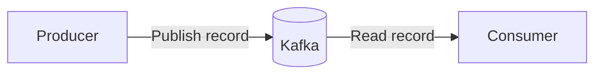

Kafka sits between the applications.

That sounds simple, but the interesting part is everything that happens inside that middle box.

Kafka organizes records into **topics**, and topics are divided into **partitions**. Consumers read records from partitions and track their position using offsets. Consumer groups allow multiple consumers to cooperate when processing a topic. These concepts form the core of Kafka's producer/consumer model. citeturn0search9turn0search6

---

## Why not just use REST?

Suppose I have an Order Service.

When an order is created, several things might need to happen:

```text
Order Created
      |
      +----> Send email
      |
      +----> Update inventory
      |
      +----> Generate invoice
      |
      +----> Notify analytics
```

With direct HTTP calls, the Order Service could end up knowing about all of these services.

```text
Order Service
   |
   +----> Email Service
   |
   +----> Inventory Service
   |
   +----> Invoice Service
   |
   +----> Analytics Service
```

Now imagine the inventory service is unavailable.

Should the order creation fail?

Should the request wait?

Should the application retry?

Should the email service be called before or after inventory?

These questions become part of the application's synchronous request path.

Kafka introduces another model:

```text
                    +--> Email Service
                    |
Order Service --> Kafka --> Inventory Service
                    |
                    +--> Invoice Service
                    |
                    +--> Analytics Service
```

The Order Service publishes an event.

Other services decide whether they are interested in that event.

This is one of the reasons event-driven architectures can reduce direct coupling between services.

---

# The first thing I wanted to understand: the message

Let's say my application creates this event:

```json
{
  "orderId": "ORD-1001",
  "customerId": "C-42",
  "amount": 2499,
  "event": "ORDER_CREATED"
}
```

I publish it to a Kafka topic:

```text
orders
```

At this point, I initially imagined Kafka as something like a queue:

```text
orders
-------------------------
message
message
message
```

But Kafka's model is more interesting.

A topic is divided into partitions.

For example:

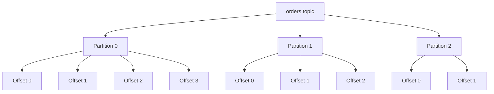

The partition is one of the most important concepts to understand if you want to understand Kafka properly.

---

# Topics are not the whole story

A topic is a logical name for a stream of records.

For example:

```text
orders
payments
notifications
user-events
```

But the actual records are stored within partitions.

So instead of thinking:

```text
orders
  |
  +-- all messages
```

I started thinking:

```text
orders
  |
  +-- Partition 0
  |
  +-- Partition 1
  |
  +-- Partition 2
```

This is important because partitions provide a mechanism for scaling processing.

A consumer doesn't simply consume "the topic" as one giant object. It reads records from partitions.

---

# Partitions

Suppose I have three partitions:

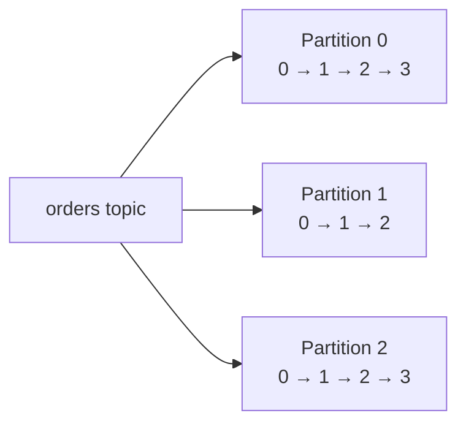

Kafka can distribute records across partitions.

A record can also have a key.

For example:

```text
key = customerId
```

The key can influence which partition receives the record.

That matters when ordering is important.

If events belonging to the same key are consistently routed to the same partition, their order can be preserved within that partition.

That gives me an important mental model:

> **Kafka ordering is fundamentally tied to partitions, not to the entire topic.**

---

# Then I discovered offsets

This was one of the concepts that made Kafka click for me.

Every record within a partition has an offset.

For example:

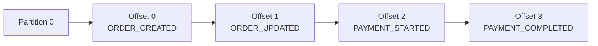

The offset represents a position in the partition.

A consumer can therefore know:

> "I have processed up to this position."

This is very different from thinking:

> "Kafka gave me a message and then removed it."

Kafka's consumer model is based around reading records and tracking positions.

The Kafka consumer API exposes offset-related operations, including committing and querying offsets. citeturn0search6turn0search9

---

# The consumer doesn't make the message disappear

This was one of the first assumptions I wanted to get rid of.

A traditional queue often leads me to think:

```text
Queue
   |
   +--> Consumer
          |
          +--> message removed
```

Kafka's model is closer to:

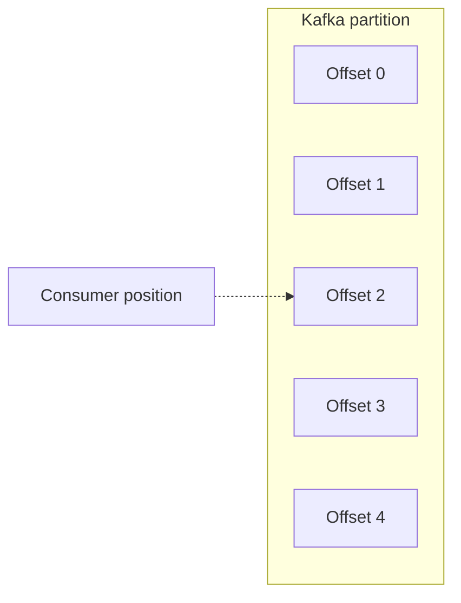

The consumer tracks where it is.

That opens up an interesting possibility:

A different consumer can read the same records independently.

This is where consumer groups become important.

---

# Consumer Groups

Imagine I have one consumer:

```text
orders topic
     |
     v
Consumer A
```

Now imagine I have three consumers belonging to the same consumer group:

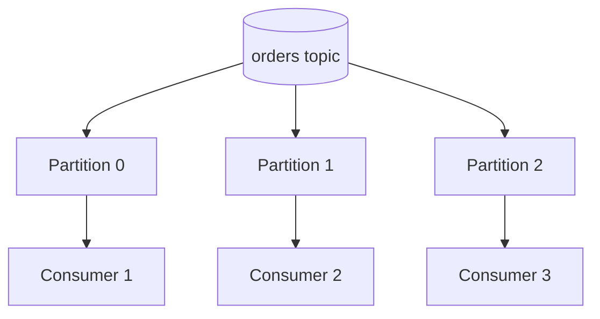

Kafka can distribute partitions among consumers in the same consumer group.

This allows processing work to be distributed.

The important restriction is that, within a consumer group, a partition is assigned to one consumer at a time.

So if I have:

```text
3 partitions
3 consumers
```

I can potentially have:

```text
P0 -> C1
P1 -> C2
P2 -> C3
```

But if I have:

```text
3 partitions
5 consumers
```

there aren't enough partitions for every consumer to have its own partition.

That means some consumers will have nothing assigned to them.

This gave me another important lesson:

> **Adding consumers does not automatically mean more parallelism. Partition count matters.**

---

# What happens when a consumer dies?

This is where Kafka becomes much more interesting.

Suppose:

```text
P0 -> Consumer A
P1 -> Consumer B
P2 -> Consumer C
```

Then Consumer B disappears.

Kafka can rebalance the consumer group so another consumer takes responsibility for the affected partition.

Conceptually:

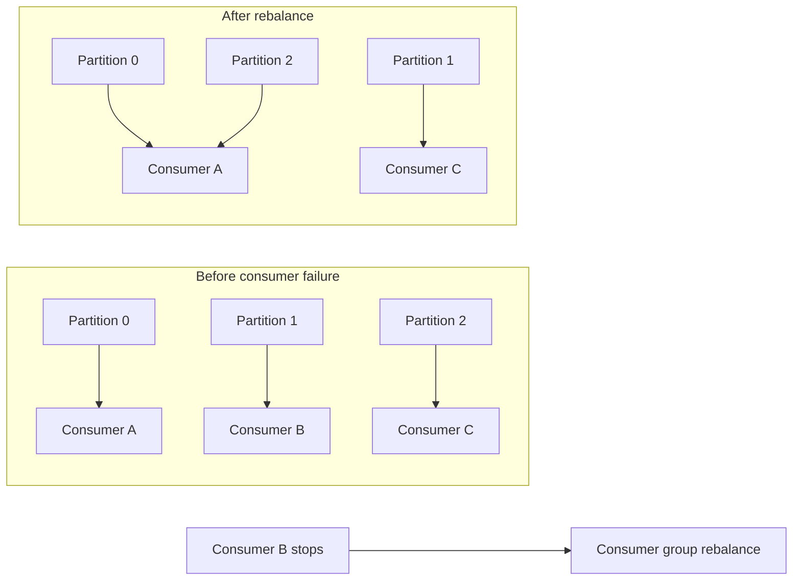

The exact assignment depends on the group's assignment mechanism and cluster state, but the important idea is that partitions can be reassigned when group membership changes.

Kafka exposes consumer-group and partition-assignment concepts directly through its consumer APIs. citeturn0search6

This is one of the things I want to experiment with rather than just reading about it.

---

# What if the consumer is slower than the producer?

Now consider this:

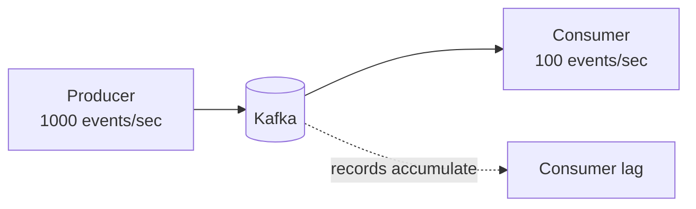

The consumer cannot keep up.

The records accumulate in the log faster than the consumer processes them.

This is where the idea of **consumer lag** becomes important.

Conceptually:

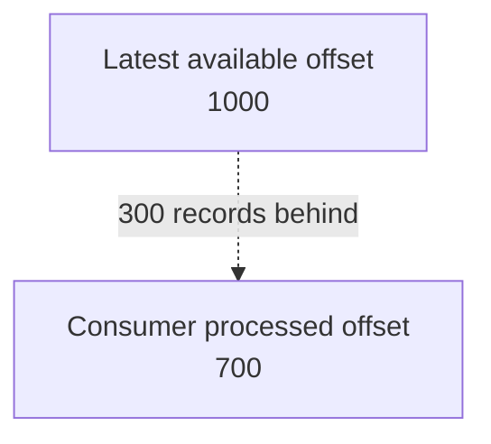

The gap between what is available and what the consumer has processed is a useful signal when operating Kafka systems.

That gives me another experiment:

> What happens to lag when I deliberately slow down a consumer?

---

# Kafka and ordering

One thing I don't want to oversimplify is ordering.

Suppose I publish:

```text
ORDER_CREATED
ORDER_PAID
ORDER_SHIPPED
```

I might expect the consumer to always receive:

```text
CREATED
PAID
SHIPPED
```

But Kafka's ordering guarantee needs to be understood in the context of partitions.

Kafka preserves record order within a partition.

It does not mean that records across different partitions have one global ordering.

So if ordering matters for a particular entity, partitioning strategy becomes an architectural decision.

For example:

```text
customerId = C42

C42 -> Partition 1

ORDER_CREATED
ORDER_PAID
ORDER_SHIPPED
```

This is one of the areas where a simple "Kafka is fast" explanation doesn't help much.

The interesting part is understanding **why the architecture behaves this way**.

---

# Kafka isn't just a faster REST call

This is probably the biggest change in my mental model.

REST asks:

> "Can you perform this operation and give me the result?"

Kafka can represent:

> "This event happened."

Those are different communication models.

### REST

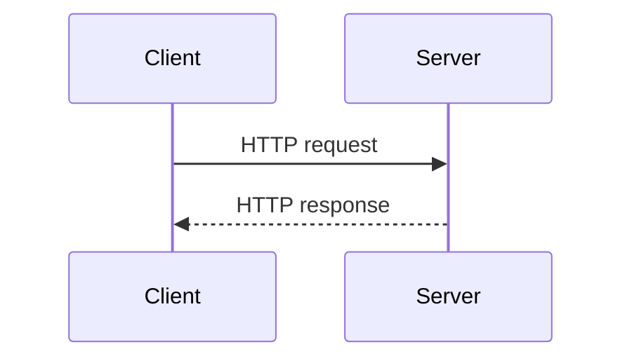

### Kafka

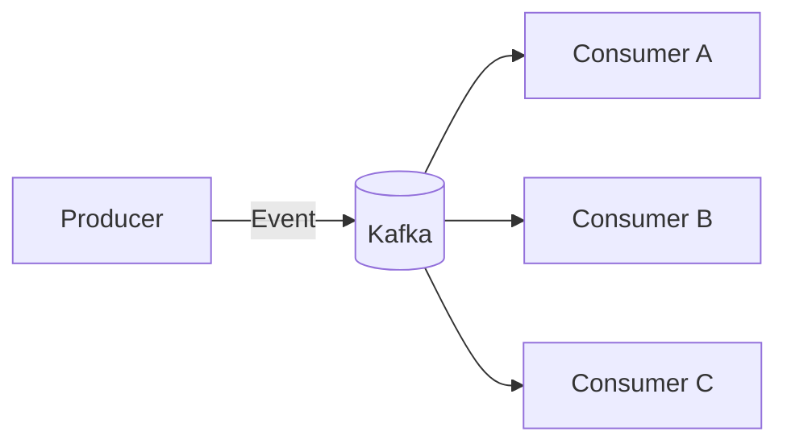

The producer doesn't need to know every consumer.

That is the part of Kafka that interests me more than simply calling it a messaging system.

---

# The experiment I want to build

Rather than learning Kafka entirely from documentation, I want to build a small system.

Something like:

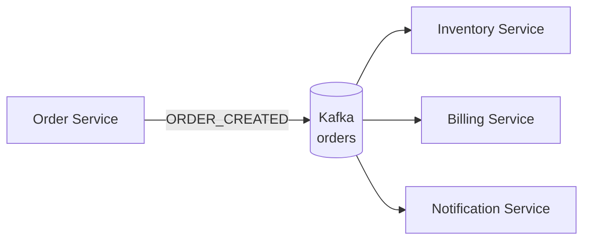

The implementation doesn't need to be huge.

I could start with:

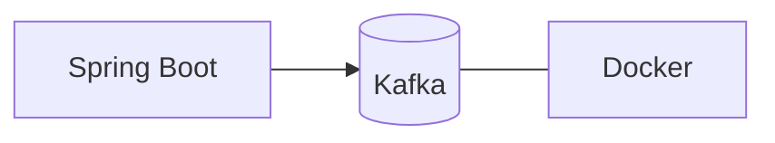

And create:

### Producer

```java
kafkaTemplate.send("orders", order);
```

### Consumer

```java
@KafkaListener(topics = "orders")
public void consume(Order order) {
    System.out.println(order);
}
```

The code itself isn't the interesting part.

The interesting part is watching what happens behind it.

---

# Experiments I want to run

Instead of stopping after getting one message from producer to consumer, I'd like to deliberately break things.

## Experiment 1 — One producer, one consumer

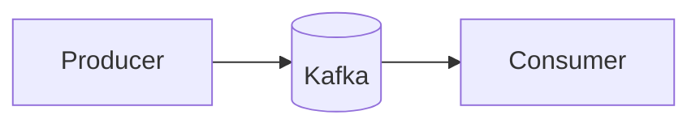

Questions:

- Where is the record?
- What is its offset?
- When does the consumer receive it?
- What happens after consumption?

---

## Experiment 2 — Multiple partitions

Create:

```text
orders

P0
P1
P2
```

Then produce many records.

Observe:

- How records are distributed
- How keys affect partitioning
- How ordering behaves

---

## Experiment 3 — Multiple consumers

Start:

```text
C1
C2
C3
```

inside the same consumer group.

Observe which consumer receives which partition.

Then stop one consumer.

Watch the group rebalance.

---

## Experiment 4 — Slow consumer

Artificially delay processing:

```java
Thread.sleep(5000);
```

Then produce messages quickly.

Observe:

```text
Producer rate
Consumer rate
Consumer lag
```

This should make the idea of backpressure and lag much easier to understand.

---

## Experiment 5 — Consumer restart

Stop the consumer.

Produce messages.

Start it again.

Then investigate:

> Where does it continue from?

This is where offsets become much more tangible.

---

## Experiment 6 — Two consumer groups

Create:

```text
Group A
    Consumer A1

Group B
    Consumer B1
```

Both consume the same topic.

Now observe that both groups can independently process the same events.

This is one of the features that makes Kafka useful for event-driven architectures.

---

# Things I'm still figuring out

This is where I think Kafka gets interesting.

I don't want to pretend I understand every part of it just because I can explain the terminology.

The questions I want to answer through experiments are:

- How exactly does partition assignment work?
- What happens during a rebalance?
- What actually happens when a consumer crashes?
- How are offsets stored?
- What is the difference between automatic and manual offset commits?
- How does consumer lag develop?
- What happens when processing fails?
- How should retries be designed?
- What role do replication and leaders play?
- What happens when a broker goes down?
- How does Kafka maintain availability?
- Where does Kafka's performance actually come from?

These are much more interesting questions than memorizing Kafka definitions.

---

# My current mental model

After starting this exploration, my mental model looks roughly like this:

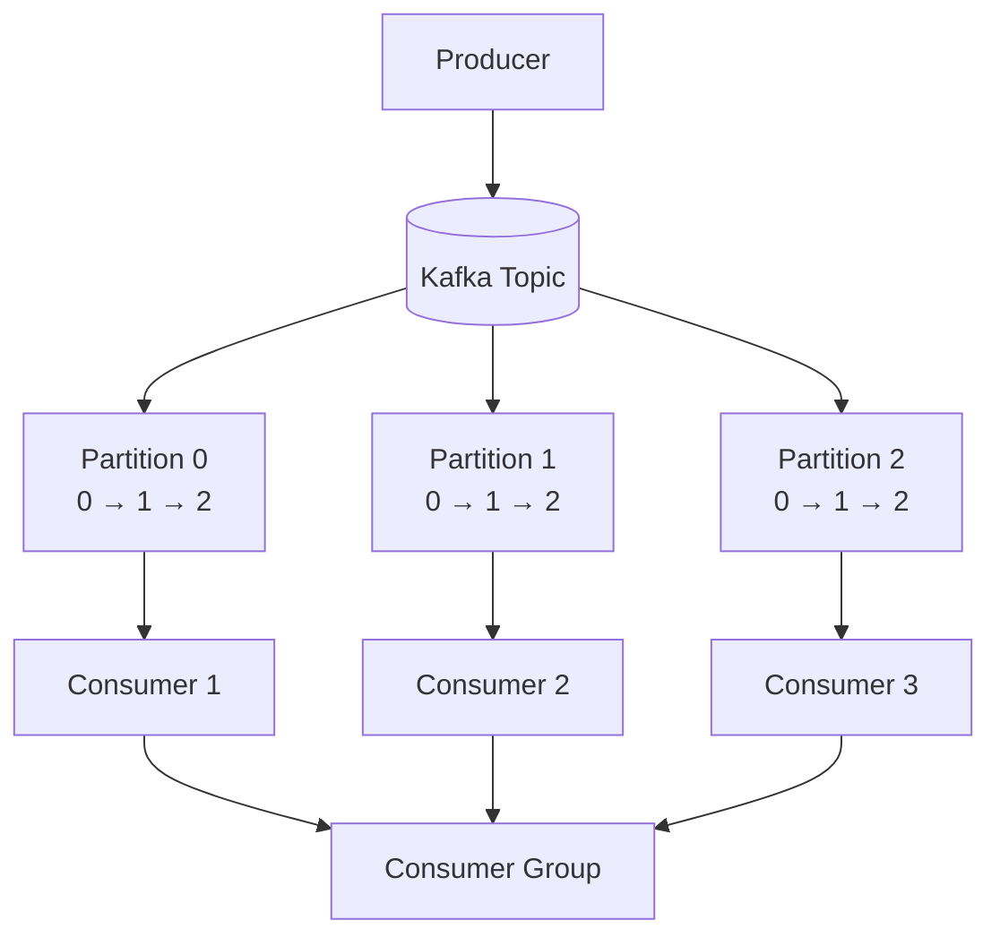

And the thing connecting a consumer to the data is not simply "the message."

It's the **position in the partition — the offset**.

That is probably the most important concept I took away from the first stage of exploring Kafka.

---

# What I want to explore next

I'm not done with Kafka yet.

The next level for me is moving from:

```text
Producer → Kafka → Consumer
```

to:

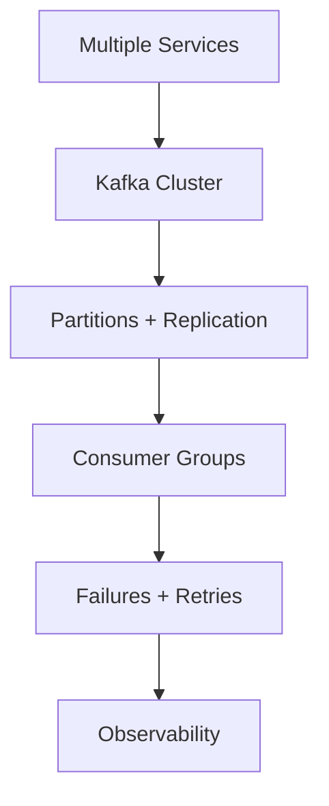

That's where Kafka stops being a demo and starts becoming an actual distributed-systems problem.

And that's exactly the part I'm interested in understanding.

---

## Final thought

I started looking at Kafka because I kept seeing it in backend architectures.

But I don't think the useful question is:

> "How do I add Kafka to a Spring Boot project?"

The better question is:

> **"What problem is Kafka solving, and what trade-offs does it introduce?"**

That's the question I want to keep exploring.

Because using a technology is easy.

Understanding why the system is designed that way is the interesting part.

---

*This article is part of my ongoing VoidStack exploration of backend systems, distributed architectures, and the abstractions underneath the tools I use.*

## References

- Apache Kafka documentation and APIs — official Kafka project documentation. citeturn0search9turn0search6
