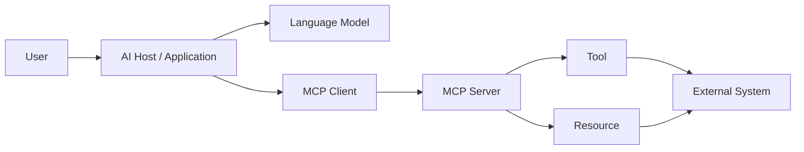
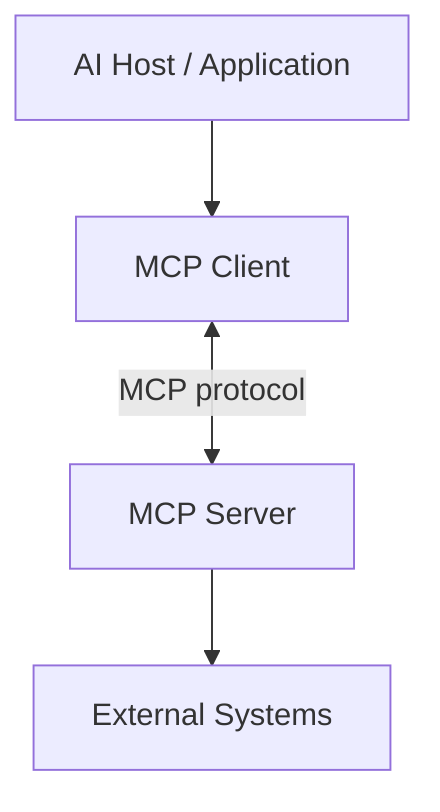
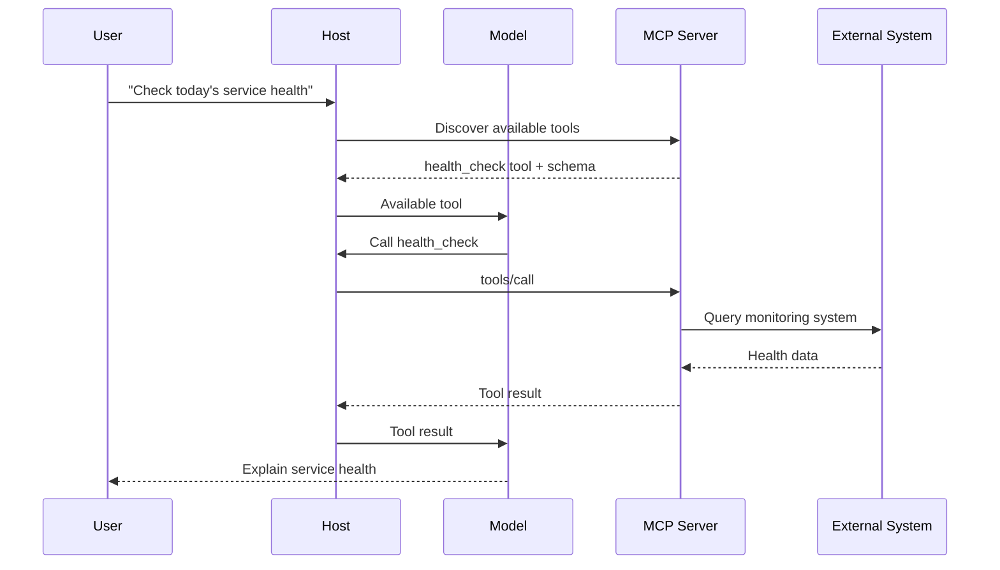
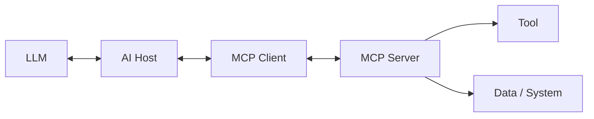
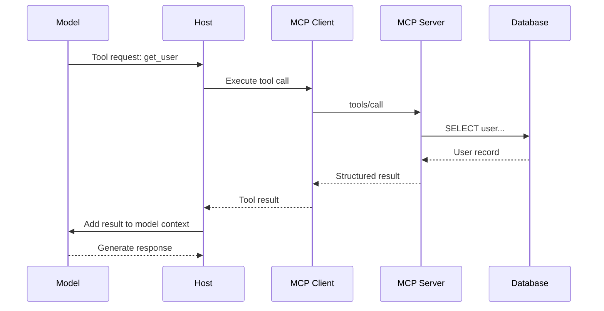
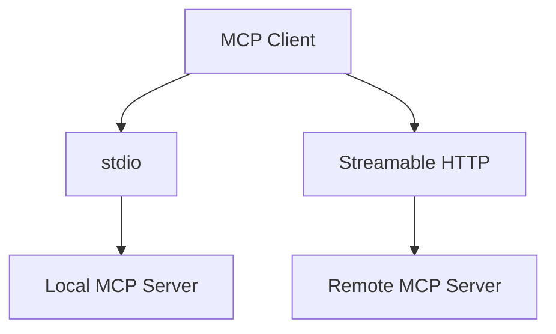
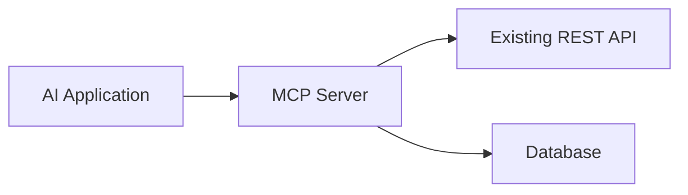
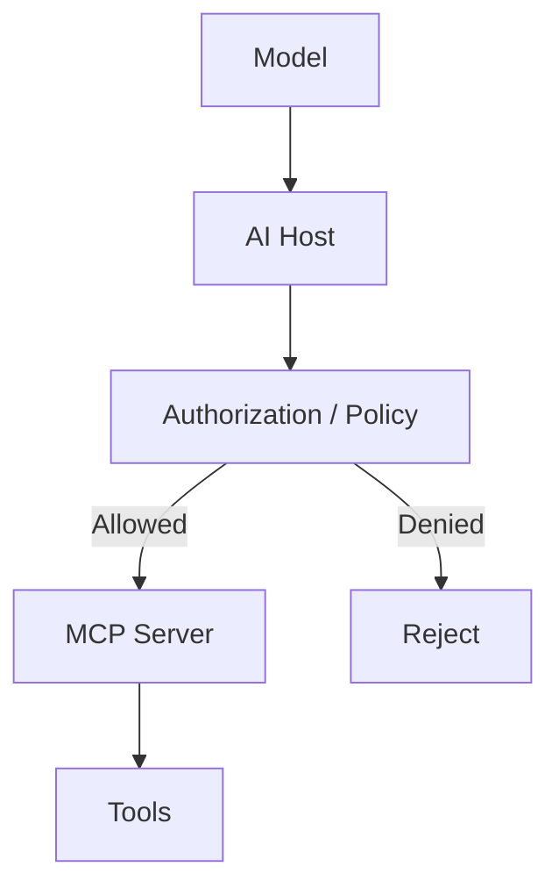

# MCP: I Wanted to Understand How AI Actually Gets Tools

I kept seeing **MCP** everywhere.

AI agents. Coding assistants. Tool calling. Context. Connectors. Local servers. Remote servers.

At first, MCP looked like another acronym in the rapidly growing AI ecosystem.

But there was a more interesting question:

> **What actually happens when an AI application needs to use a tool that lives outside the model?**

That question is what made me start digging into MCP.

The more I looked at it, the less MCP felt like an "AI feature" and the more it looked like a protocol problem.

---

## The problem I was trying to understand

An LLM can generate text.

That does not mean it can directly:

- read my filesystem
- query a database
- call an internal API
- inspect Git repositories
- execute a deployment
- retrieve application metrics
- interact with an external service

Something has to sit between the model and those systems.

A simplified architecture looks like this:



The interesting part is the boundary between the **AI application** and the systems it needs to interact with.

Without a common protocol, every AI application could invent its own integration mechanism.

That creates a familiar engineering problem:

```text
AI Application A ── custom integration ── Database
AI Application B ── custom integration ── GitHub
AI Application C ── custom integration ── Filesystem
AI Application D ── custom integration ── Internal API
```

The integrations become tightly coupled to individual applications.

MCP attempts to standardize that interaction.

The official documentation describes MCP as an open standard for connecting AI applications to systems where data and tools live.

---

## So what exactly is MCP?

The simplest way I understand it now is:

> **MCP is a protocol that defines how an AI host can discover and interact with capabilities exposed by an MCP server.**

That sentence is deliberately less exciting than most AI marketing descriptions.

But it is much more useful.

An MCP setup commonly has three important pieces:



### Host

The host is the AI application.

It owns the overall interaction with the user and the model.

### Client

The MCP client is the protocol-side connection maintained by the host.

It communicates with an MCP server and handles the protocol interaction.

### Server

The MCP server exposes capabilities.

Those capabilities can include things such as:

- tools
- resources
- prompts

The important realization for me was that **the model does not need to know how the external system works internally**.

The server provides a standardized interface.

---

# Tools, Resources, and Prompts

This was one of the first places where MCP became interesting.

I initially thought:

> "MCP server = collection of functions."

That's only part of the picture.

## 1. Tools

Tools represent actions that can be invoked.

For example:

```text
get_weather(location)
query_database(sql)
create_ticket(title, description)
search_repository(query)
```

The AI application can discover available tools and provide the model with their descriptions and input schemas.

The model can then decide that a tool is useful for the current task.

Conceptually:



This is where MCP starts looking less like a library and more like infrastructure.

---

## 2. Resources

Resources are different.

Instead of representing an action, they represent information that can be exposed through the protocol.

Think:

```text
file://...
database://...
docs://...
config://...
```

The exact resource design depends on the server, but the important distinction is:

```text
Tool      → "Do something"
Resource  → "Give me information"
```

That distinction matters when designing integrations.

A system doesn't have to expose everything as a function.

---

## 3. Prompts

MCP also has a prompt concept.

A prompt can be a reusable message template that a client can invoke.

For example, imagine a code-review server exposing:

```text
review-code
```

with parameters such as:

```text
code
language
review_style
```

The server can provide a structured prompt rather than forcing every client to reinvent the same prompt template.

This creates another useful separation:

```text
Tools      → capabilities/actions
Resources  → contextual data
Prompts    → reusable interaction templates
```

---

# MCP is not the model

This distinction is important.

MCP does **not** replace the language model.

It also does not magically make a model intelligent.

A better mental model is:



The model is responsible for reasoning over the information provided to it.

The host orchestrates the interaction.

MCP provides a standardized protocol for communicating with external capabilities.

That separation is important because it means the same MCP server can potentially be used by different MCP-compatible hosts.

---

# Then how does the model actually use a tool?

This is where I started thinking about MCP as a systems problem rather than an AI buzzword.

Suppose an MCP server exposes:

```text
get_user
```

with an input:

```json
{
  "userId": "123"
}
```

The model doesn't directly open a network socket to the server.

Instead, the host is involved.

A simplified flow is:



The exact implementation details depend on the host, client, server, transport, and SDK.

But this mental model helped me understand the important boundary:

> **The model proposes or requests an action; the surrounding application actually performs the protocol interaction.**

That is a much more useful way to think about agentic systems.

---

# Where does JSON-RPC fit?

Another thing I wanted to understand was the protocol itself.

MCP uses **JSON-RPC** as part of its communication model.

That gives the protocol a structured request/response mechanism.

Conceptually:

```json
{
  "jsonrpc": "2.0",
  "method": "tools/call",
  "params": {
    "name": "get_user",
    "arguments": {
      "userId": "123"
    }
  }
}
```

The exact protocol messages and schemas are defined by the MCP specification.

The important point for me was that MCP isn't simply:

```text
POST /some-random-endpoint
```

with every implementation inventing its own payload format.

There is a defined protocol layer.

---

# Transport is another separate concern

This was another useful distinction.

The protocol and the way messages travel are related, but they are not the same thing.

MCP implementations support transports such as:

```text
stdio
Streamable HTTP
```

A local MCP server might communicate through standard input/output.

A remotely accessible implementation can use HTTP-based transport.

Conceptually:



This separation is important because it means the protocol isn't fundamentally tied to one deployment model.

A local developer tool and a remotely hosted MCP service can use the same protocol concepts while differing in how communication is transported.

---

# Why not just use REST APIs?

This was probably my biggest question.

If I already have:

```text
GET /users/123
POST /tickets
GET /metrics
```

why do I need MCP?

The answer isn't that REST suddenly becomes obsolete.

REST and MCP solve different problems.

A REST API usually exposes application capabilities to software developers.

An MCP server exposes capabilities in a form designed for discovery and interaction by AI applications.

The distinction can be thought of like this:

```text
Traditional application

Client
  ↓
Known API contract
  ↓
REST API
  ↓
Service


MCP-based AI application

AI Host
  ↓
MCP Client
  ↓
Discover capabilities
  ↓
MCP Server
  ↓
Tools / Resources / Prompts
  ↓
Existing systems
```

An MCP server can even sit in front of existing APIs.

For example:



The existing backend does not necessarily need to become an MCP server itself.

The MCP server can act as an integration boundary.

---

# The part that concerns me: tool access

Once an AI can interact with external systems, the problem changes.

It is no longer only:

> "Can the model generate a correct answer?"

Now we also have:

> "What is the model allowed to make the system do?"

Imagine an MCP server exposing:

```text
read_logs
query_database
delete_record
restart_service
deploy_application
```

Those are very different capabilities.

Giving an AI access to all of them without controls would be a terrible architecture.

A safer design starts by treating tools as privileged operations.



The protocol itself should not be treated as a substitute for authorization, validation, isolation, auditing, or least-privilege design.

That became one of the most important things I took away from exploring MCP.

---

# MCP changes the integration boundary

Before looking into MCP, I mostly thought about AI integrations like this:

```text
Application
    |
    +-- GitHub integration
    +-- Slack integration
    +-- Database integration
    +-- Filesystem integration
    +-- Monitoring integration
```

Now I think about another possibility:

```text
                    +-- GitHub
                    |
AI Host → MCP → MCP Server
                    |
                    +-- Database
                    |
                    +-- Filesystem
                    |
                    +-- Monitoring
```

That creates a more standardized boundary.

But there is a trade-off.

You have introduced another component.

That means you now have:

- another process or service
- another protocol boundary
- another security boundary
- another place to debug
- another place where permissions can go wrong

So MCP isn't "free architecture."

It is an architectural choice.

---

# The experiment I want to build

Reading about MCP is useful.

Building one is more useful.

My next experiment would be a tiny local MCP server.

Not an enormous AI agent.

Not a complicated framework.

Something intentionally small.


The server could expose three capabilities:

```text
Tool:
    search_notes(query)

Resource:
    notes://latest

Prompt:
    summarize-notes
```

Then I want to observe:

1. How the host discovers the server.
2. How capabilities are advertised.
3. What the actual protocol messages look like.
4. How a tool call is represented.
5. What happens when the tool fails.
6. What happens when arguments are invalid.
7. How the result gets back to the model.
8. What security boundaries exist around the server.

That would turn MCP from something I read about into something I actually understand.

---

# What I understand now

After digging into it, my mental model is much simpler.

```text
MCP is not:

"an AI brain"

MCP is:

"a standardized protocol boundary between AI applications
and external capabilities."
```

The important pieces are:

```text
Host
  ↓
MCP Client
  ↓
MCP Protocol
  ↓
MCP Server
  ├── Tools
  ├── Resources
  └── Prompts
       ↓
External systems
```

And the interesting engineering questions are not just:

> "How do I create an MCP server?"

They are:

> How are capabilities discovered?

> How are tool arguments validated?

> How are permissions enforced?

> What happens when a tool fails?

> How do we audit tool calls?

> How do we secure remote MCP servers?

> How do we prevent an AI from abusing a legitimate capability?

Those questions are much more interesting to me than simply connecting an LLM to another API.

---

# Final thought

MCP initially looked like another AI acronym.

After looking underneath it, I see a more familiar engineering problem:

**standardizing communication between components that need to work together.**

The AI part makes the problem interesting because the caller is no longer necessarily a deterministic piece of application code.

A model can decide which capability to use based on the context it receives.

That means the protocol boundary suddenly becomes part of an agent's action surface.

And that is where things get interesting.

I don't think the important question is:

> "Is MCP the future?"

The more useful question is:

> **"What happens when we give software a standardized way to discover and invoke capabilities?"**

That's the part I want to experiment with next.

---

## Sources

- [Model Context Protocol — official documentation](https://modelcontextprotocol.io/)
- [MCP TypeScript SDK v2](https://ts.sdk.modelcontextprotocol.io/v2/)
- [MCP Python SDK](https://py.sdk.modelcontextprotocol.io/)
- [MCP Specification](https://modelcontextprotocol.io/specification/)
