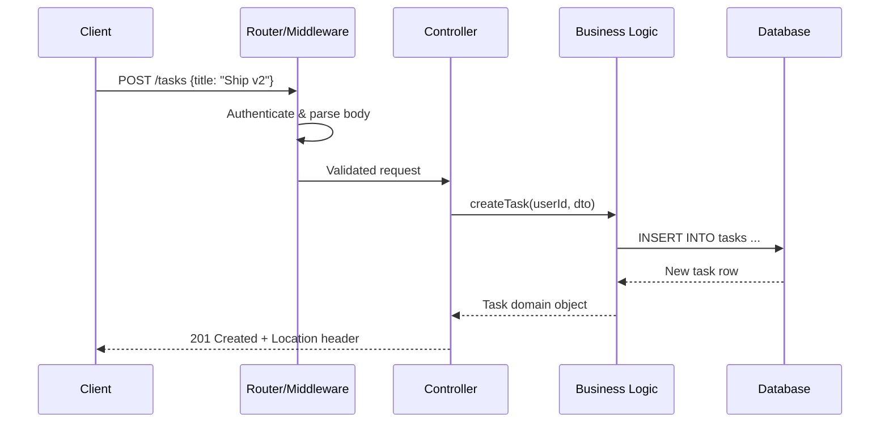

# The request journey

A REST API is more than a controller method. A request travels through networking, routing, middleware, validation, business logic, persistence, and response serialization.

In this article, we will trace the full lifecycle of a single request, then look at the design decisions - methods, status codes, idempotency, versioning, pagination, and errors - that separate a REST API that merely works from one that is pleasant and safe to build on.

We will use a small **task management API** as a running example: clients create, read, update, and delete tasks belonging to a user.

## A useful mental model

1. The client creates an HTTP request.
2. The server accepts the connection and routes the request.
3. Application code validates input and executes business logic.
4. The application communicates with a database or another service.
5. The server serializes the result into an HTTP response.

Understanding each step makes debugging easier because you can narrow a failure to a specific boundary instead of treating the entire API as a black box.



Each arrow in this diagram is a place where things can fail, and a well-designed API turns each failure into a specific, predictable response rather than a generic error.

## 1. HTTP methods and what they promise

REST leans on HTTP methods to communicate intent, and clients rely on the guarantees each method implies.

| Method | Purpose | Safe | Idempotent |
| --- | --- | --- | --- |
| `GET` | Read a resource | Yes | Yes |
| `POST` | Create a resource or trigger an action | No | No |
| `PUT` | Replace a resource entirely | No | Yes |
| `PATCH` | Partially update a resource | No | No (usually) |
| `DELETE` | Remove a resource | No | Yes |

**Safe** means the method does not change server state, so it can be cached, prefetched, or retried freely. **Idempotent** means making the same request multiple times produces the same end state as making it once, which matters when a client times out and needs to safely retry.

```http
GET /tasks/42 HTTP/1.1
Host: api.example.com
```

```http
PUT /tasks/42 HTTP/1.1
Content-Type: application/json

{ "title": "Ship v2", "status": "IN_PROGRESS" }
```

Calling `PUT /tasks/42` five times in a row with the same body leaves the task in the same state as calling it once. Calling `POST /tasks` five times creates five tasks, because creation is not idempotent by definition.

### Making POST safer to retry

Because `POST` is not idempotent, network retries can create duplicate resources. A common fix is an idempotency key supplied by the client:

```http
POST /tasks HTTP/1.1
Idempotency-Key: 3f29-91ab-4e2c

{ "title": "Ship v2" }
```

The server stores the key alongside the created resource. If the same key arrives again, typically because a client retried after a timeout, the server returns the original response instead of creating a second task.

## 2. Status codes as a contract

Status codes are part of the API's contract, not just an HTTP formality. Grouping them by their first digit is often enough to reason about behavior:

- **2xx** - the request succeeded. `200 OK` for a normal response, `201 Created` for a new resource, `204 No Content` when there is nothing to return, such as after a `DELETE`.
- **4xx** - the client made a mistake. `400 Bad Request` for malformed input, `401 Unauthorized` for missing or invalid credentials, `403 Forbidden` for valid credentials without permission, `404 Not Found` for a missing resource, `409 Conflict` for a state clash such as a duplicate email.
- **5xx** - the server made a mistake. `500 Internal Server Error` for unexpected failures, `503 Service Unavailable` when a dependency is down or the server is overloaded.

A common mistake is returning `200 OK` with an error message in the body. This forces every client to parse the response body just to know whether the call succeeded, defeating one of the main benefits of using HTTP status codes in the first place.

## 3. Statelessness

A core REST constraint is that each request must contain everything the server needs to process it. The server does not rely on data left over from a previous request for the same client.

```http
GET /tasks HTTP/1.1
Authorization: Bearer eyJhbGciOi...
```

The bearer token identifies the user on every request rather than relying on server-side session state tied to a specific server instance. This is what makes it possible to place multiple stateless API instances behind a load balancer, as shown in the cloud infrastructure article: any instance can handle any request, because no instance is holding session state that another instance lacks.

## 4. Validation at the boundary

Input validation belongs at the edge of the system, before business logic runs, so that invalid data never reaches the parts of the code that assume it is already correct.

```java
public record CreateTaskRequest(
    @NotBlank @Size(max = 200) String title,
    @NotNull TaskPriority priority
) {}

@PostMapping("/tasks")
public ResponseEntity<TaskResponse> createTask(@Valid @RequestBody CreateTaskRequest request) {
    Task task = taskService.createTask(currentUserId(), request);
    return ResponseEntity.created(locationOf(task)).body(TaskResponse.from(task));
}
```

When validation fails, the response should explain what was wrong in a structured, machine-readable way rather than a plain string:

```json
{
  "error": "VALIDATION_FAILED",
  "details": [
    { "field": "title", "message": "must not be blank" }
  ]
}
```

This lets client applications highlight the specific field that failed instead of showing a generic "something went wrong" message.

## 5. Pagination

Returning an entire table in one response does not scale. Cursor-based and offset-based pagination are the two common approaches.

```http
GET /tasks?limit=20&cursor=eyJpZCI6MTIzfQ
```

```json
{
  "items": [ { "id": 124, "title": "Write tests" } ],
  "nextCursor": "eyJpZCI6MTQ0fQ",
  "hasMore": true
}
```

Offset pagination (`?page=2&size=20`) is simpler to implement but can skip or repeat rows if data changes between requests. Cursor pagination is more resilient to concurrent inserts and deletes, at the cost of not supporting jumping directly to an arbitrary page number.

## 6. Versioning

APIs change, and clients cannot all upgrade simultaneously. Versioning gives a way to change a resource's shape without breaking existing clients.

- **URI versioning**: `GET /v1/tasks` versus `GET /v2/tasks` - explicit and easy to route, but can lead to duplicated controller code.
- **Header versioning**: `Accept: application/vnd.example.v2+json` - keeps URLs stable, but is less visible when browsing or debugging.

Whichever approach is chosen, the more durable habit is designing responses to be additive: new optional fields can be introduced without a version bump, since well-behaved clients ignore fields they do not recognize. Removing or renaming a field is what actually requires a new version.

## 7. Caching

`GET` responses can often be cached, which reduces load and improves latency for repeated requests.

```http
GET /tasks/42 HTTP/1.1
If-None-Match: "a1b2c3"
```

```http
HTTP/1.1 304 Not Modified
```

The server computes an `ETag` for the resource. If the client already has that exact version, the server can respond with `304 Not Modified` and an empty body instead of resending the full representation, which is especially useful for large or expensive-to-generate responses.

## 8. Error responses as a first-class concern

A consistent error shape makes client-side error handling predictable across every endpoint, instead of every failure needing bespoke handling:

```json
{
  "error": "TASK_NOT_FOUND",
  "message": "No task exists with id 42",
  "traceId": "6f1c2e9a-6b1e-4e2f-9a51-2b6d9f6a10a2"
}
```

Including a `traceId` that matches an entry in the server's logs turns "the API is broken" into a specific log line that can be found in seconds, which matters as much operationally as it does to the client consuming the API.

## Key takeaway

A REST API is a set of promises encoded in HTTP: methods describe intent, status codes describe outcomes, and consistent structure for pagination, versioning, and errors is what makes an API predictable enough for other engineers - including a future version of yourself - to build against with confidence.

